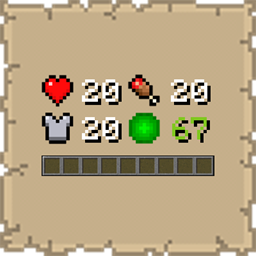

# Numerical HUD

## Functionality

  

   
Numerical HUD overhauls your survival interface by condensing vital stats into a centralized, data-driven display located directly above the experience bar.

### Core Modules
* **Advanced Health & Absorption:** Displays exact HP with color-coded states for Poison, Wither, Frozen, and Hardcore modes. Includes a "Panic" animation when health is low.
* **Smart Armor Tracking:** Real-time numerical defense rating that "blinks" when your armor value changes.
* **Detailed Hunger & Saturation:** Tracks food levels and saturation simultaneously, featuring a "starvation" shake animation when hunger hits zero.
* **Precise Experience:** Shows your level and exact progress percentage (e.g., `Level 25.4`) with color transitions from yellow to green as you gain XP.
* **Oxygen & Breath:** A specialized module that only appears underwater, featuring a unique "popping bubble" animation when air is consumed.
* **Vehicle & Mount Stats:** Automatically displays the health and jump-strength of horses, llamas, and other rideable entities when mounted.

### Animation System
Unlike static text mods, Numerical HUD features a custom **BaseHudModule** system:
* **Linear Interpolation:** Values transition smoothly between numbers rather than jumping instantly.
* **Visual Cues:** Numbers change color (Green for healing/gaining, Red for damage/losing) during transitions.
* **Icon Blinking:** HUD icons flash during state changes to maintain the "Vanilla" reactive feel.

## Benefits

  

   
* **Data-Driven Gameplay:** Know exactly how many HP you have left or how much saturation a food item provided.
* **Clean UI:** Removes the clutter of 40+ individual heart/hunger icons, freeing up screen real estate.
* **Performance:** Built on highly optimized Mixins that stop vanilla bars from rendering entirely, reducing overhead.
* **Context Aware:** Modules for Oxygen and Vehicles only appear when relevant, keeping your HUD minimal during normal play.

## Installation

  

   
1.  **Requirements**: Ensure you have Minecraft 1.21.10, Fabric Loader 0.18.4, and the Fabric API installed.
2.  **Download**: Get the latest `.jar` from [Modrinth](https://modrinth.com/mod/numerical-hud) or [CurseForge](https://www.curseforge.com/minecraft/mc-mods/numerical-hud).
3.  **Setup**: Drop the file into your `%appdata%/.minecraft/mods` folder.

## Support

  

   
If you encounter bugs or wish to contribute:
* [Report any problems you find.](https://github.com/armaninyow/Numerical-HUD/discussions/categories/issues)
* [Share your ideas for new features.](https://github.com/armaninyow/Numerical-HUD/discussions/categories/suggestions)

## Credits

  

   
* **Author**: Armaninyow
* **License**: Released under [CC0-1.0](https://creativecommons.org/publicdomain/zero/1.0/).

