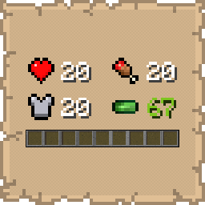

# Numerical HUD

## Installation

* [Modrinth](https://modrinth.com/mod/numerical-hud)
* [CurseForge](https://www.curseforge.com/minecraft/mc-mods/numerical-hud)

## Support
   
If you encounter bugs or wish to contribute:
* [Report any problems you find.](https://github.com/armaninyow/Numerical-HUD/discussions/categories/issues)
* [Share your ideas for new features.](https://github.com/armaninyow/Numerical-HUD/discussions/categories/suggestions)

## Changelog

  

   
### 3.0.0—1.21.x
* Added multi-version support covering Minecraft 1.21 through 1.21.11
* Replaced the Animation Style config option with a proper enum selector dropdown
* Updated saturation and XP orb icon textures
* Removed saturation fade effect, saturation icon now displays at full opacity or not at all
### 2.0.0—1.21.11
* Updated to Minecraft 1.21.11
### 1.3.0—1.12.10
* Added Configuration system via Mod Menu and Cloth Config API: access settings in-game through the Mod Menu screen
* Added Animation Style selector: choose between three animation modes for all modules (except XP):
    * Decimal (default): values count up/down with decimal precision during transitions
    * Fade: the integer value snaps immediately, the text color transitions from Green/Red back to White over 1 second using a quint ease-in curve
    * Popup: a delta label (e.g. +2, -3) floats beside the module for 1 second, traveling 9 pixels up (heal) or down (damage) with an ease-out effect
* Added Show Armor at Zero toggle: when disabled, the Armor module is hidden entirely while the player has no armor equipped
* Fixed Decimal animation no longer fires false triggers from sub-integer regeneration ticks
* Fixed Decimal animation cooldown no longer blocks a direction-reversing animation (e.g. removing armor immediately after equipping it now correctly plays the green increase animation)
* Improved Hunger module icons now properly switch to their blinking variants when its value drops and during recurring blink animations
### 1.2.0—1.21.10
* Implemented a recurring blink system where the HUD icon blinks at intervals relative to the current value (lower health/hunger results in faster recurring blinks), mirroring vanilla behavior
    * Blink interval is based on current value (N seconds where N = floor(current value))
    * Example: At 5 health, icon blinks every 5 seconds; at 10 health, every 10 seconds
    * System applies to Health, Hunger, and Vehicle Health modules
* Replaced Health Module's panic animation with recurring blink system
* Replaced Hunger Module's panic animation with recurring blink system
* Added recurring blink system in Vehicle Health Module
### 1.1.0—1.21.10
* Refreshed the mod's visual identity with a new icon
* Changed the Saturation overlay color in the Hunger Module to Yellow (utilizing the absorption heart texture color). This provides much better contrast and visibility compared to the previous overlay
* Updated development environment and dependencies to target Minecraft version 1.21.10
* Updated yarn_mappings (1.21.10+build.3), loader_version (0.18.4), and loom_version (1.14-SNAPSHOT) to the latest standards
* Refactored code across all files to follow official FabricMC formatting and naming conventions
### 1.0.0—1.21.10
* Initial Release

